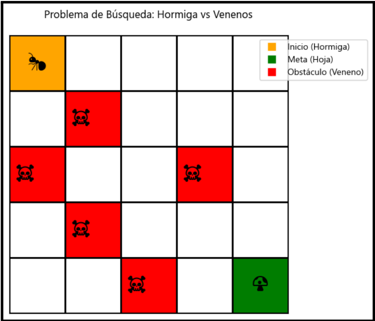

---

## 👥 Integrantes del Grupo

| Nombre Completo       | Código  | Rol            | Correo Electrónico       |
|-----------------------|---------|----------------|--------------------------|
| Edwar Yamir Forero Blanci        | 2559741  | Colab | [edwar.forero@univalle.edu.co]|
| [Estudiante 2]        | 123457  | [Colaborador]  | [correo2@institucion.edu]|
| [Estudiante 3]        | 123458  | [Colaborador]  | [correo3@institucion.edu]|
| [Estudiante 4]        | 123459  | [Colaborador]  | [correo4@institucion.edu]|

---

Vamos a resolver un problema clásico, donde la hormiga debe encontrar el hongo mágico, y
puede pasar por venenos.
El agente va a aplicar estas dos variaciones de los algoritmos que vimos en clase:
1. Beam Search: Es una versión de la búsqueda informada que limita la cantidad de nodos
que se mantienen en cada nivel (la "amplitud de la viga" o β). En cada nivel del árbol,
solo se expanden los β nodos más prometedores (según h(n) o f(n)), y el resto se
descartan permanentemente.
2. Dynamic Weighting: En lugar de un peso fijo ε como en Weighted A*, esta técnica ajusta
el peso de la heurística dinámicamente. Por ejemplo, f(n) = g(n) + h(n) + ε * (1 - (d(n)/N)) * h(n), donde d(n) es la profundidad. Da más peso a h(n) al principio de la búsqueda
(para alejarse rápido de la raíz) y menos peso cerca de la meta (para refinar la
búsqueda y garantizar optimalidad)

Notas:

- La matriz debe ser cambiable, en posiciones y tamaño
- Sin interfaz gráfica no aceptó el proyecto, pierde el proyecto, no es válido hacer y
mostrar la solución por consola. Es necesario hacer una interfaz gráfica donde vea la
hormiga moviéndose
- La nota del proyecto es grupal pero su nota es individual. El proyecto les puede quedar
en 5, pero si en la sustentación no me demuestra un dominio mínimo, se le puede poner
hasta 0, dependiendo de la magnitud de la falta de dominio
- Sugiero hacer en python por practicidad, pero no es obligación

- Grupos de 3 o 4 personas. Menos tampoco, somos muchos, si se hacen de a 2
personas o peor aún individual, no alcanzamos a sustentar todos. Así que este
semestre como somos tantos, no acepto proyectos individuales o en pareja.